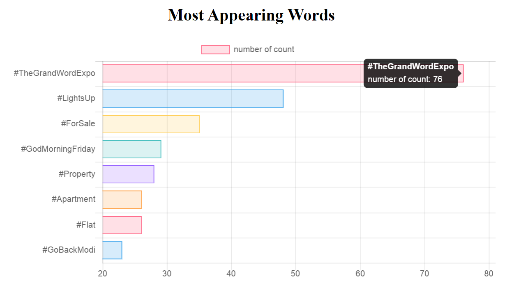
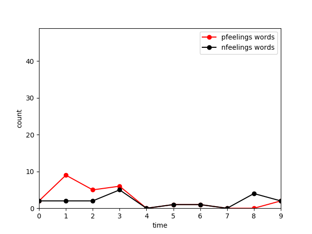

# TwitterPipe: Twitter stream real-time processing and visualization
 
 ## Overview
 This project builds data pipelines for Twitter stream data using Spark and Kafka, and provides visualization of the real-time results with Flask, JavaScript chart and AJAX. The project has two parts: 
 * `popular_hashtags` implements a microbatch data pipeline using Spark for the 8 most popular Twitter hashtags. Spark requests and receives stream data from Twitter APIs (1% of all public tweets) and performs microbatch processing in every second to compute and extract the current 8 most popular hashtags from the stream. Spark immediately sends the processing results via HTTP requests to a lightweight server established using Flask. A frontend web page is provided for users to visualize popular hashtag results, which uses AJAX to fetch real-time data from the Flask server and JavaScript chart to update the visualization every second. 
 
 |  |
:-------------------------:
| <em>Project diagram of popular_hashtags</em> |
 
 * `word_monitor` implements a positive/negative word monitor for public tweets using Kafka and Spark. Kafka serves as a message broker that is highly efficient for large-scale data processing. In this project, Kafka takes the Twitter APIs as the producer and Spark as the consumer. Spark reads data from Kafka and performs microbatch processing every second. The program runs for 10 seconds by default and produces a plot showing the positive/negative word counts in every second during that period. 
 
|  |
:-------------------------:
| <em>Project diagram of word_monitor</em> |

## Source Code
 Data processing scripts are written in Python.
 * [`popular_hashtags`](popular_hashtags) - data pipeline for popular Twitter hashtags
    - `twitter_to_spark.py` - establishs the data stream from Twitter APIs to Spark
    - `spark_process.py`- processes data using Spark and forward the results to Flask server
    - `visualize/app.py` - Flask server 
 * [`word_monitor`](word_monitor) - positive/negative word monitor
    - `kafka_listener.py` - establishs the data stream from Twitter APIs to Kafka
    - `spark_consumer.py`- reads data from Kafka, processes data using Spark and produces the plot using `matplotlib`
    - [dataset](word_monitor/dataset) - contains positive/negative word lists
 
 ## Usage
 * You need to register a Twitter developer account at [https://developer.twitter.com/](https://developer.twitter.com/) and create your own app to get the keys and tokens for accessing the Twitter APIs. Substitute your keys and tokens in `twitter_to_spark.py` and `kafka_listener.py`. <br />
 * Install Scala and JDK on your machine. This is because Spark is written in Scala, which uses the compiler provided by JDK. Also check your Python version to make sure you are using Python2. <br />
 * Download Spark and Kafka in the root directory of this project. For Linux, run
```
wget https://archive.apache.org/dist/spark/spark-2.4.4/spark-2.4.4-bin-hadoop2.7.tgz
tar -xvzf spark-2.4.4-bin-hadoop2.7.tgz

wget https://archive.apache.org/dist/kafka/2.3.0/kafka_2.11-2.3.0.tgz
tar -xvzf kafka_2.11-2.3.0.tgz
```
* For `popular_hashtags`:
    - Start the pipeline:
    ```
    cd popular_hashtags
    ./start-pipe.sh
    ```
    - See visualization at `http://<Your IP address>:5050`
    - Stop the pipeline:
    ```
    ./stop-pipe.sh
    ```
* For `word_monitor`:
    - Install the Python packages used:
    ```
    pip install tweepy
    pip install kafka-python
    pip install matplotlib
    ```
    - Before start your Python program, you need to start Zookeeper and Kafka server first (keep them running in the background):
    ```
    cd kafka_2.11-2.3.0
    bin/zookeeper-server-start.sh config/zookeeper.properties &
    bin/kafka-server-start.sh config/server.properties &
    ```
    - Start the pipeline:
    ```
    cd word_monitor
    python kafka_listener.py
    ```
    - In a new shell, run
    ```
    cd spark-2.4.4-bin-hadoop2.7
    bin/spark-submit --packages org.apache.spark:spark-streaming-kafka-0-8_2.11:2.4.4 ../word_monitor/spark_consumer.py
    ```
    The `spark_consumer` program will run for 10 seconds. This duration can be modified by sepecifying the input to [`ssc.awaitTerminationOrTimeout()`](https://github.com/medium-roast/TwitterPipe/blob/532048beb45bb28041bb94b43c219a829fac16dc/word_monitor/spark_consumer.py#L65) in `spark_consumer.py`. You will see the generated file `feelingAnalysis.png` under your current directory. 
    - Stop the pipeline using `Ctrl + C` for `kafka_listener.py`. To stop your Kafka server, use `ps` command to find PID of your Kafka and Zookeeper process, then use `kill` command to stop it.
    ```
    ps aux
    kill -9 <PID>
    ```
    
    
## Demo
|  |
:-------------------------:
| <em>Visualization for popular_hashtags at `http://<Your IP address>:5050`. Contents will update every second.</em> |

|  |
:-------------------------:
| <em>Generated plot `feelingAnalysis.png` for word_monitor</em> |
 
 
 
 
 
 
 
